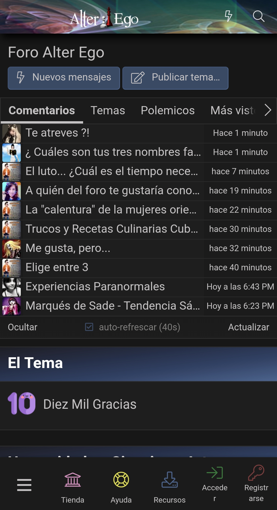
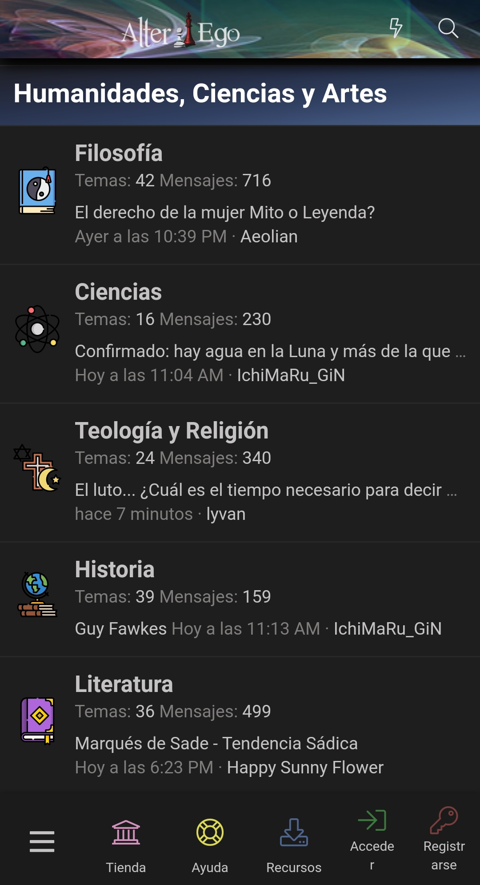
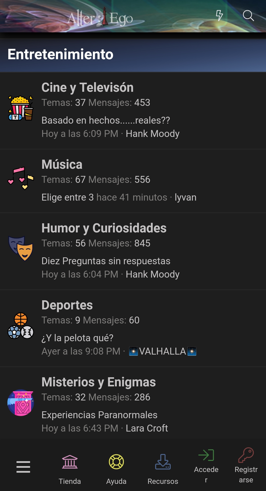
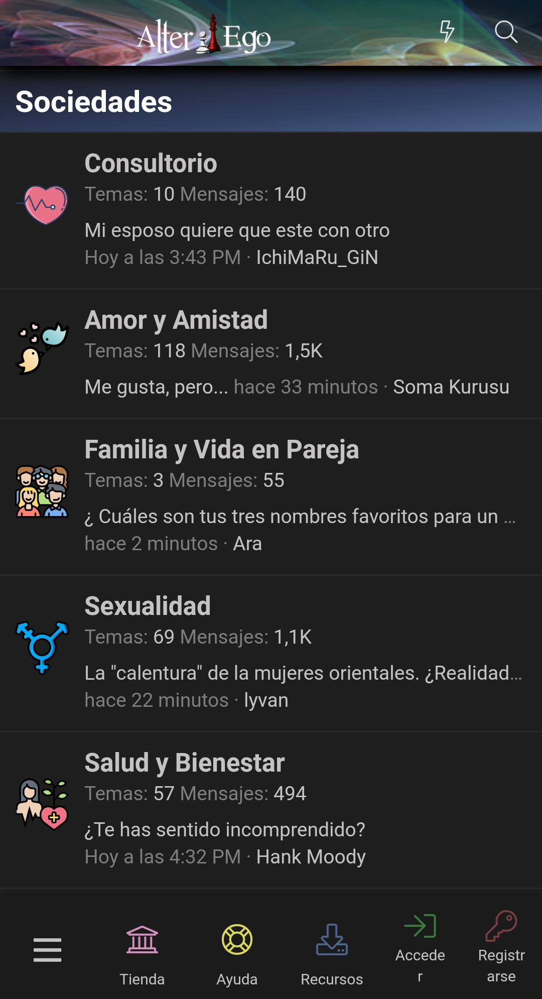
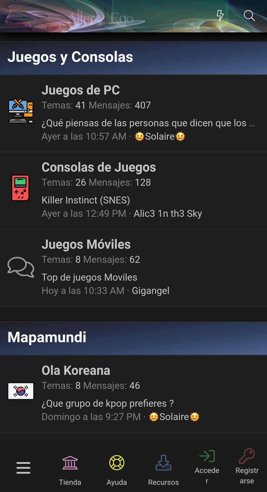

<p align="center">
  
</p>

<br>

# AlterEgo WebView App

Lightweight Android client built for the AlterEgo forum.

## Overview

This project was developed as a real-world solution for an online forum that did not expose a public API.

Given the technical and budget constraints, a WebView-based Android app was the most practical approach. The initial goal was to provide a simple mobile client for forum access, but the project gradually evolved with several improvements focused on usability, navigation, and better integration with Android features.

Although the original forum is no longer available, this repository is preserved as part of my portfolio because it represents a real product built for real users and improved through actual usage.

The application was released in multiple iterations (v1.0 and v1.1.1), incorporating UI improvements, navigation refinements, and general stability fixes based on real usage.

## Real-World Context

This was not just a practice project.

The app was published on an app distribution platform and used by real members of the forum. It also received direct user feedback and reviews, which helped shape incremental improvements to the experience over time.

That makes this project valuable to me not only as Android code, but as evidence of building software for a real-world need under real constraints.

## Features

- Embedded WebView for full forum navigation
- Internal forum links handled inside the app
- External links opened in the device's default browser
- Swipe gestures for backward and forward navigation
- Pull-to-refresh support
- Page loading progress bar
- File attachment support through the Android file chooser
- Landscape orientation support
- Deep linking support for forum URLs
- Double-back press to exit behavior for better navigation flow

## Screenshots

### v1.1.1


### v1.0






## Technical Details

- **Language:** Java
- **Platform:** Android
- **Project Type:** Native Android app using WebView as the main client interface
- **Main Domain Handled:** `https://www.alterego.nat.cu/`

### Android integration highlights

- WebView with JavaScript and DOM storage enabled
- Custom `WebViewClient` to keep forum navigation inside the app
- External URL delegation using Android intents
- `WebChromeClient` implementation for file uploads
- Swipe gesture navigation using a custom touch listener
- Intent filter for direct opening of forum links in the app
- Manual handling of configuration changes for orientation support

## Why This Project Matters

This project demonstrates several practical engineering decisions:

- Choosing an appropriate solution when a full native app was not viable
- Extending a simple WebView app with meaningful UX improvements
- Integrating Android platform features such as deep links, external intents, gestures, and file selection
- Iterating on a real product based on user interaction and feedback

It reflects a pragmatic development mindset: solving the actual problem first, then improving the experience where it matters.

## Project Structure

This repository keeps a clean standard Android project structure:

```
app/
gradle/
build.gradle
gradle.properties
gradlew
gradlew.bat
settings.gradle
CHANGELOG.md
README.md
```

## Changelog

A summary of the main improvements made to the app is available in:

`CHANGELOG.md`

## Important Note

The original forum no longer exists, so this application is no longer active as a live product.

This repository is shared strictly for portfolio purposes to showcase:

- Android development in Java  
- Real-world product delivery  
- UX-oriented improvements on top of a constrained architecture  
- Practical integration with core Android capabilities  

## License

This project is shared for portfolio and educational purposes.
